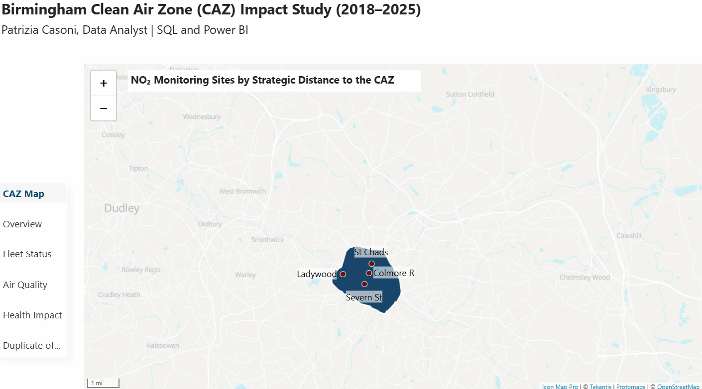
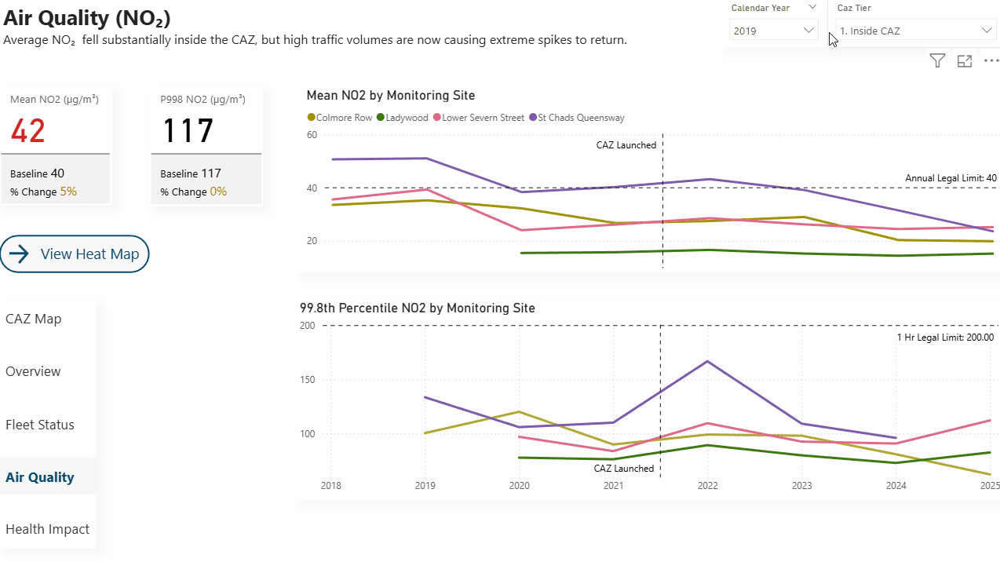

# Birmingham Clean Air Zone (CAZ) Impact Study (2018-2025)

Launched in June 2021 following a UK Government legal mandate, the Birmingham Clean Air Zone (CAZ) was implemented to tackle persistent breaches of legal Nitrogen Dioxide (NO2) limits by accelerating the modernisation of the city’s vehicle fleet. This data project analyses the policy's progress between 2018 and 2025 across three core pillars: air quality improvements, fleet compliance, and early signals in respiratory hospital admissions. By engineering a custom 5-Tier Spatial Framework to categorise both monitoring sites and hospital wards based on their distance from the zone, this study evaluates the true environmental and public health impact of the policy. Through a detailed analysis of the volume, type, and compliance of vehicles entering the CAZ, alongside regional air quality and health trends, the project provides a data-driven foundation to understand what should happen next based on the evidence observed so far.

## 1. Tech Stack

* **Database & Architecture:** PostgreSQL, DBeaver, Star Schema Data Modelling
* **Geospatial Analysis:** PostGIS, QGIS
* **Business Intelligence:** Power BI, Icon Map Pro
* **Languages:** SQL, DAX
* **Version Control:** Git, GitHub

## 2. Repository Structure

* **`01_database_setup/`**: SQL scripts for building the PostgreSQL star schema, configuring PostGIS, and importing raw CSV/GeoJSON data.
* **`02_eda_and_diagnostics/`**: Diagnostic queries to validate spatial boundaries, sensor accuracy, and establish strict data completeness rules.
* **`03_data_cleaning_and_staging/`**: Scripts to impute unrecognised vehicles, process calendar and fiscal NO2 annualisations, and classify sites and wards into 5 spatial CAZ tiers.
* **`04_analytical_views/`**: The final, optimised SQL views feeding directly into Power BI, including unified spatial datasets.
* **`05_power_bi_dashboards/`**: The final interactive dashboard, saved as a Power BI Project (.pbip) to enable source control and separate the semantic model from the report layout.
* **`data/`**: The raw source files (e.g. CSVs and spatial data) used for the initial ingestion into the PostgreSQL database.

## 3. Challenges & Solutions

* **Handling Incomplete Sensor Data & Annualisation:**
  * **The Challenge:** Sensor outages and historical data gaps made raw NO2 averages unreliable and complicated standard data imputation.
  * **The Solution:** Built a strict SQL pipeline that first filtered out severe equipment errors (NO2 < -1.0) before enforcing a 75% monthly completeness rule. Reliable years (9+ valid months) were kept as-is, and unusable years (<3 months) were dropped entirely. For partial years (3–8 months), I engineered a spatial algorithm to dynamically match the incomplete site to its nearest valid background monitor, imputing the missing data by applying a scaling ratio that reflects the normal proportional difference between the two sites.
 
* **Geospatial Proximity Classification:**
  * **The Challenge:** Geographically distinct datasets—lat/long points for NO2 monitoring sites versus polygon areas for hospital wards—lacked a shared spatial hierarchy. This made it impossible to analyze the CAZ's ripple effect outward into areas outside the centre of Birmingham.
  * **The Solution:** Utilized PostGIS to project all coordinates to EPSG:27700. I then calculated exact edge-to-edge distances from the CAZ boundary, unifying both the NO2 and hospitalisation datasets into a single 5-tier proximity system for seamless categorisation and reporting.
 
* **Deriving Meaningful Pollution Metrics from Traffic Data:**
  * **The Challenge:** Raw ANPR traffic counts were insufficient for air quality analysis. Camera misreads ("Unrecognised" vehicles) accounted for up to 10% of annual traffic, and basic vehicle counts could not explain how a simultaneous drop in non-compliant vehicles (-58,000) and rise in overall traffic (+88,000) impacted actual emissions.
  * **The Solution:** I built an SQL pipeline to algorithmically impute the "Unrecognised" vehicles, distributing them across specific vehicle types based on monthly probability shares. I then fed this cleaned dataset into Power BI, creating a custom DAX measure (`Pollution Load`) that applied distinct NO2 proxy weights based on both vehicle type and compliance status, accurately calculating the net change in real-world tailpipe emissions.
 
* **Aligning Disparate Datasets for Correlation:**
  * **The Challenge:** To prove the CAZ's real-world impact, emissions data needed to be correlated with NHS respiratory hospitalisations. However, the NHS data was only provided as annual fiscal year totals (April–March) with no monthly breakdown available. Because NO2 and traffic data are recorded by standard calendar years, they could not be directly compared.
  * **The Solution:** I standardized the entire project around the NHS fiscal calendar. I wrote SQL logic to translate the daily traffic data into fiscal years, and completely rebuilt the complex NO2 annualisation pipeline from scratch so that all 9-month completeness rules and background site estimations operated on a strict April-to-March basis. This allowed all three datasets to be seamlessly joined and cross-filtered in Power BI.
 
 ## 4. Dashboard & Insights

* **Visualizing the Spatial Proximity Tiers**
This page provides a clear, foundational overview of the project's spatial architecture. To prevent visual clutter, the Icon Map Pro visual focuses strictly on mapping the NO2 monitoring sites across five strategic spatial classifications:

  * **Tier 1:** Inside CAZ (Direct policy enforcement zone)
  * **Tier 2:** Close Boundary / Ring Road (<=500m from the CAZ)
  * **Tier 3:** Near Boundary (500m to 2km)
  * **Tier 4:** Background (2km to 5km)
  * **Tier 5:** Outer Regional Control (>5km from the CAZ)

To optimize performance, I processed all spatial data upstream in PostgreSQL. By using a `UNION`, I combined the `dim_caz_tiers` (boundary polygons) and `monitoring_sites` tables into a single database view. To make this work seamlessly, I explicitly converted the raw latitude and longitude coordinates into Well-Known Text (WKT) `POINT` strings, allowing both the points and polygons to share a single geometry column. 

Next, I had to overcome Power BI's strict character limits, which initially caused the complex CAZ polygons to break the visual. I resolved this natively in PostGIS by applying `ST_Simplify()` to reduce the map's vertex count and `ST_AsText()` to round the coordinates to five decimal places, ensuring flawless rendering. 

Finally, because Icon Map Pro cannot natively format multiple distinct layers, I created a custom DAX measure (`Map Tier Colors`) to apply a blue gradient to the spatial zones while highlighting the active monitoring sites in striking red.

  
<b>🎥 Click to view the CAZ Spatial Map Build</b>

   
  

 

* **Interactive Air Quality & Drill-Through Analysis**
This dashboard page tracks Mean NO2 and 99.8th Percentile trends from 2018 to 2025, allowing users to cross-filter by CAZ tier and specific monitoring sites. KPI cards dynamically compare the selected year's averages and percentiles against the 2018 baseline. Crucially, the 99.8th percentile line chart—which reveals that extreme pollution spikes are returning in some areas by 2025—features advanced drill-through capabilities. Users can drill into specific data points to investigate the exact date and time of the top 19 hourly pollution spikes for a given site in any year. The page also features a "View Heat Map" navigation button for further hourly pollution distribution analysis.

  
<b>🎥 Click to view the Air Quality Drill-Through in action</b>

   
  

## 5. Key Insights & Conclusions

* **The Spatial Health Ripple Effect:** The CAZ achieved its primary initial goal. NO2 levels dropped significantly inside the zone, which directly correlated with a measurable improvement in COPD hospitalisations within the CAZ and its close boundary (<=500m). Furthermore, the data proved that these dual benefits—reduced NO2 and lower hospital admissions—were not confined to the centre, but successfully radiated outwards.
* **The Limits of Fleet Modernization:** While the CAZ successfully removed 58,000 highly polluting vehicles, overall traffic grew by 88,000. Crucially, the data revealed that 85% of all vehicles entering the CAZ are personal cars. Because the policy penalizes engine types rather than total traffic volume, net pollution has remained flat over the past year, even though highly polluting vehicles dropped by 52%.
* **Localized Spikes & The Next Policy Frontier:** By 2025, hourly pollution spikes (99.8th percentile) started growing again in a number of areas. The heat maps reveal that these spikes are highly localized and tied to the specific economic busy hours of different areas. Moving forward, city policy must shift toward reducing total car volume by deploying targeted public transport interventions precisely mapped to these localized peak hours. Crucially, these alternatives must be convenient and lower-cost; if public transit remains considerably more expensive than driving, people will simply continue to use their cars.

## 6. How to Reproduce This Work

1. **Prerequisites:** Install PostgreSQL (with PostGIS) and Power BI Desktop.
2. **Schema & Spatial Setup:** Execute `01_database_setup/01a_relational_schema_setup.sql` and `01_database_setup/01b_spatial_configuration.sql`.
3. **Data Import:** Update local paths and run `01_database_setup/02_data_import.sql`.
4. **Staging & Remediation:** Run scripts in `03_data_cleaning_and_staging/`, followed by `01_database_setup/03_star_schema.sql`.
5. **Analytical Views:** Execute `04_analytical_views/01_caz_impact_views.sql`.
6. **Dashboard:** Open `05_power_bi_dashboards/Birmingham CAZ_July 2026.pbip` in Power BI.

